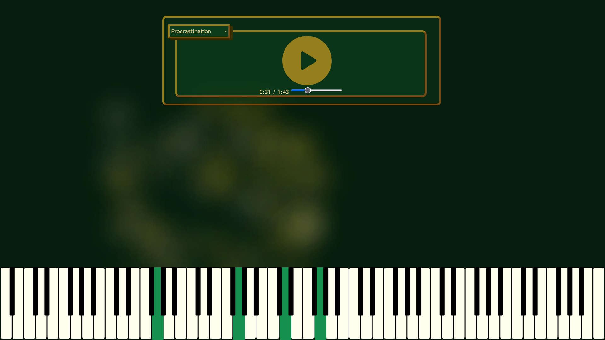

# MIDI Player
This application is a music player that I use to showcase my music. It also reads MIDI files associated with my music and plays a piano on the screen.

A live demo can be found at [my personal website's music page](https://alexmelfi.com/music/).

#

This screenshot shows the piano being played alongside the music player.

## Music
The music showcased in this application has all been created by me. They are listed from newest to oldest.

- Inquisitive
- Stony Walk
- New Joy
- Chord Experiments
- Procrastination

### The application does not currently work properly on mobile devices. While the music player works fine, the piano does not render correctly.